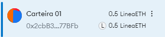
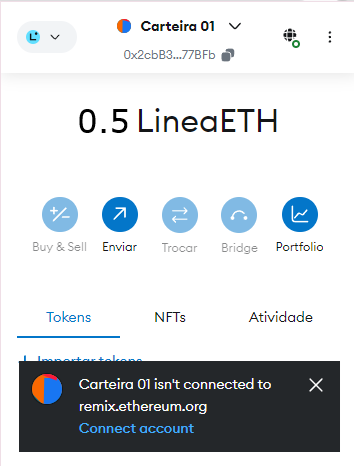
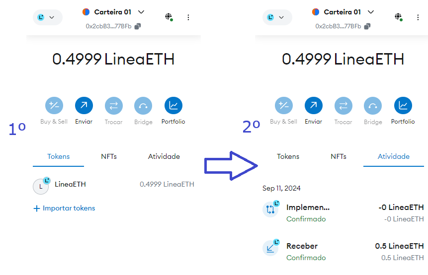
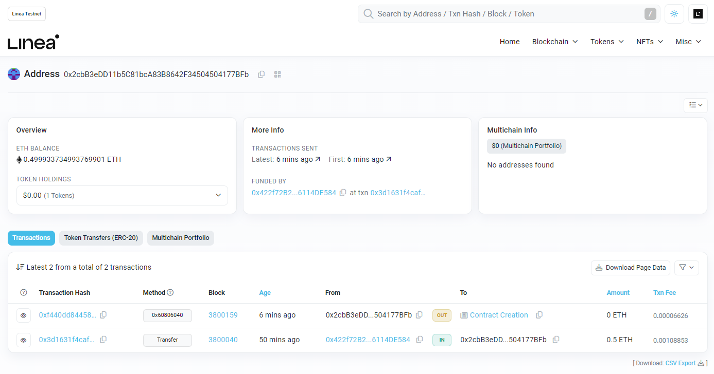

# Primeiro Token do Zero nos Padrões Web3
Criação de um token na rede de TESTE Etherium Linea Sepolia

## 1º Deve carregar algum saldo para uma carteria

Para efetuar o carregamento, foram utilizados de dois sites:
 - [INFURA](https://app.infura.io/)
 - [ChainLink](https://faucets.chain.link/linea-sepolia)
 - OBS:. endereços costumam mudar, então basta procurar pelo faucet necessário no google.

## 2º Implementação

Implantar a código do arquivo: [token.sol](token.sol) na IDE do Remix.

Preencher dados necessários, e verificar quaisquer erros de compilação.

## 3º Conectar carteira com o Remix

Na opção de Deploy no Remix, deve-se utlizar o ambiente como:
- Injected Provider - MetaMask

E assim é habilitado a conexão da carteira com o Remix, via Metamask:

## 4º Efetuando o deploy do contrato

No ambiente: Injected Provider - MetaMask e com a respectiva carteira com saldo conectada. Basta selecionar o contrato e efetuar o deploy.

## 5º Verificação final

Observando no próprio Metamask
- Deverá ter consumido algum saldo, com a realização do deploy.
- Nas atividades, pode verificar as movimentações, neste caso o recebimento, e implementação do contrato.

Observando o contrato na rede de TESTE.

